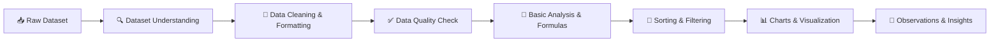

<div align="center">


<br/>

[](#)
[](#)
[](#)
[](#)
[](#)
[](#)
[](#)


[](#)
[](#)
[](#)
[](#)
[](#license)

</div>

<br/>

## 📌 About This Project

This repository contains my **Week 1 Internship Task** for the **Data Analyst Internship at Logic Stack**, focused on **Retail Sales Data Cleaning & Basic Analysis using Microsoft Excel**.

The goal of this task was to take a raw, real-world retail sales dataset and walk through the complete beginner-to-intermediate Excel analytics workflow — understanding the data, cleaning and formatting it, validating its quality, applying formulas, building summary tables, creating charts and translating the numbers into clear business insights.

This is my **first hands-on Data Analytics project**, and it forms the foundation for the more advanced analysis work planned in the upcoming weeks of the internship.

> 💼 **Internship:** Logic Stack — Data Analysis Internship (Jun 2026)

> 🧩 **Task:** Week 1 — Retail Sales Data Cleaning & Basic Analysis in Excel

> 🛠️ **Tool Used:** Microsoft Excel

> ⏱️ **Duration:** 7 Days

---

## 🎓 Internship Information


| Detail | Description |
|---|---|
| 🏢 **Company** | Logic Stack |
| 👨‍💻 **Role** | Data Analyst Intern |
| 📅 **Task** | Week 1 Assignment |
| 🧠 **Focus Area** | Excel-based Data Cleaning & Analysis |
| 📂 **Dataset** | Retail Sales Transactions (1,000 records) |


Logic Stack's Data Analysis Internship is designed to build practical, job-ready data analytics skills — starting with the fundamentals of Excel before progressing into more advanced tools like SQL, Python and BI dashboards. This repository documents my **Week 1** progress and deliverables.

---

## ✨ Features

- ✅ Beginner-friendly, real-world retail dataset (1,000 transactions)
- ✅ Full data understanding & column-level inspection
- ✅ Cleaned and properly formatted Excel Table
- ✅ Automated data quality validation using formulas
- ✅ Formula-driven KPIs (no hardcoded values)
- ✅ Category, Gender, and Age Group level breakdowns
- ✅ Native Excel charts (Bar, Column, Pie)
- ✅ Sorting & filtering demonstrations
- ✅ Clear, data-backed written observations
- ✅ Bonus: Customer Age Group segmentation

---

## 🎯 Project Objectives

The objective of this task was to build practical fluency in:

1. Opening and understanding a raw dataset before analyzing it
2. Cleaning and formatting data for readability and consistency
3. Performing data quality checks to catch blanks, duplicates and mismatches
4. Applying core Excel formulas (`SUM`, `AVERAGE`, `MIN`, `MAX`, `COUNT`, `SUMIF`, `IF`)
5. Using sorting and filtering to answer business questions
6. Building clean, readable charts for non-technical stakeholders
7. Writing simple, evidence-based observations rather than assumptions

---

## 🗂️ Dataset Information

The dataset (`retail_sales_dataset.csv`) contains **1,000 retail sales transactions** with the following columns:

| Column Name | Description |
|---|---|
| `Transaction ID` | Unique ID for each transaction |
| `Date` | Date of the transaction |
| `Customer ID` | Unique ID of the customer |
| `Gender` | Gender of the customer |
| `Age` | Age of the customer |
| `Product Category` | Category of product purchased (Beauty, Clothing, Electronics) |
| `Quantity` | Number of items purchased |
| `Price per Unit` | Price of one unit |
| `Total Amount` | Total sales amount of the transaction |

---

## 🔄 Excel Analysis Workflow



---

## 🧹 Data Cleaning Process

In the **Cleaned Data** sheet, the raw dataset was transformed into an analysis-ready table:

- Converted the full data range into a **native Excel Table** for structured referencing and filtering
- Made all column headers **bold** with a clean, professional header style
- Adjusted **column widths** so every value is fully visible
- Formatted the `Date` column using a proper `yyyy-mm-dd` date format
- Formatted `Price per Unit` and `Total Amount` as **currency**
- **Froze the top row** so headers stay visible while scrolling through 1,000 rows
- Added a **Calculated Total** column (`Quantity × Price per Unit`) to cross-verify the data

---

## ✅ Data Quality Checks

A dedicated **Data Quality Check** sheet validates the dataset using live formulas:

| Check | Result |
|---|---|
| Blank cells in the dataset | ❌ None found |
| Duplicate transactions (Transaction ID) | ❌ None found |
| Invalid `Quantity` values (≤ 0) | ❌ None found |
| Invalid `Price per Unit` values (≤ 0) | ❌ None found |
| `Total Amount` = `Quantity × Price per Unit` for every row | ✅ Matches 100% |

An **Amount Check** column flags every row as `Correct` or `Check` using:

```excel
=IF([@[Calculated Total]]=[@[Total Amount]],"Correct","Check")
```

---

## 🧮 Basic Analysis

Key metrics calculated using Excel formulas (`SUM`, `AVERAGE`, `MIN`, `MAX`, `COUNT`):

| Metric | Value |
|---|---|
| 💰 Total Sales Amount | **$456,000.00** |
| 📈 Average Sales Amount | **$456.00** |
| 🔽 Minimum Sales Amount | **$25.00** |
| 🔼 Maximum Sales Amount | **$2,000.00** |
| 📦 Total Quantity Sold | **2,514 units** |
| 🎂 Average Customer Age | **41.4 years** |
| 🧒 Youngest Customer | **18 years** |
| 👴 Oldest Customer | **64 years** |
| 🧾 Total Transactions | **1,000** |
| 🗂️ Unique Product Categories | **3** |

**Category, Gender & Age Group breakdowns** (via `SUMIF`):

<table>
<tr>
<td valign="top">

**Sales by Category**

| Category | Total Sales |
|---|---|
| Electronics | $156,905 |
| Clothing | $155,580 |
| Beauty | $143,515 |

</td>
<td valign="top">

**Sales by Gender**

| Gender | Total Sales |
|---|---|
| Female | $232,840 |
| Male | $223,160 |

</td>
<td valign="top">

**Bonus: Sales by Age Group**

| Age Group | Total Sales |
|---|---|
| Senior Adult | $193,880 |
| Adult | $144,345 |
| Young Adult | $84,550 |
| Older Customer | $33,225 |

</td>
</tr>
</table>

---

## 📊 Charts Created

Three clean, business-ready charts were built in the **Charts** sheet:

| Chart Type | Insight Visualized | Preview |
|------------|--------------------|---------|
| 📊 Bar Chart | Total Sales by Product Category |  |
| 📈 Column Chart | Total Quantity Sold by Product Category |  |
| 🥧 Pie Chart | Total Sales by Gender |  |

Each chart includes a clear title, properly labeled axes and a clean, minimal design with no unnecessary colors or effects.

---

## 🔽 Sorting & Filtering

The **Cleaned Data** sheet was sorted and filtered to answer key business questions:

- 🏆 Identified the transaction with the **highest** and **lowest** total amount
- 👗 Filtered transactions where `Product Category = Clothing`
- 🚺 Filtered transactions where `Gender = Female`
- 📦 Filtered transactions where `Quantity > 2`
- ⬇️ Sorted the dataset from **highest to lowest** Total Amount
- 🎂 Sorted the dataset from **youngest to oldest** customer

Screenshots of these filtered/sorted views are available in the `screenshots/` folder.

---

## 🔑 Key Insights

1. 📱 **Electronics** is the highest performing sales category, generating **$156,905** in total sales.
2. 💄 **Beauty** is the lowest performing sales category, with **$143,515** in total sales.
3. 🚺 **Female customers** generated slightly higher total sales (**$232,840**) than male customers (**$223,160**).
4. 🎂 The average customer age is **41.4 years**, with customers ranging from **18 to 64 years old**.
5. 📦 A total of **2,514 items** were sold across **1,000 transactions**.
6. 💵 The highest single transaction was **$2,000**, while the lowest was just **$25**.
7. ⚖️ Average spending per transaction (**$456**) shows fairly consistent purchase behavior across the customer base.
8. 👨‍🦳 The **Senior Adult** age group (41–60 years) contributed the highest sales among all age segments.

---

## 📁 Project Structure

```text
week-1-retail-sales-excel-analysis/
│
├── dataset/
│   └── retail_sales_dataset.csv
│
├── analysis/
│   └── Retail_Sales_Excel_Analysis.xlsx
│
├── screenshots/
│   ├── clothing-filter.png
│   ├── female-filter.png
│   ├── highest-sales-sort.png
│   ├── sales-by-category-chart.png
│   ├── quantity-by-category-chart.png
│   └── sales-by-gender-chart.png
│
├── README.md
└── LICENSE
```

---

## ⚙️ Installation / Usage

No installation required — this is an Excel-based analysis project.

```bash
# 1. Clone the repository
git clone https://github.com/YasirAwan4831/week-1-retail-sales-excel-analysis.git

# 2. Open the analysis file in Microsoft Excel
cd week-1-retail-sales-excel-analysis/analysis
start Retail_Sales_Excel_Analysis.xlsx
```

Then explore the sheets in order: `Original Data → Cleaned Data → Dataset Understanding → Data Quality Check → Basic Analysis → Sorting & Filtering Screenshots → Charts → Observations`.

---

## 📚 Learning Outcomes

Through this task, I strengthened my practical skills in:

- Structuring raw data into clean, analysis-ready Excel Tables
- Writing formula-driven (non-hardcoded) calculations for accuracy and reusability
- Validating data quality systematically rather than assuming clean data
- Using `SUMIF`, `IF`, and lookup-style formulas for category-level analysis
- Designing simple, readable, stakeholder-friendly charts
- Translating raw numbers into clear, written business observations
- Organizing and documenting a data project professionally on GitHub

---

## 🚀 Future Improvements

- 🔄 Automate the cleaning workflow using Power Query
- 📊 Build an interactive Excel Dashboard with slicers
- 🐍 Recreate the analysis in Python (Pandas) for comparison
- 🗄️ Migrate the dataset into SQL for query-based analysis
- 📈 Add trend analysis across the `Date` column (monthly/seasonal patterns)

---

## 🙏 Acknowledgements

Special thanks to **Logic Stack** for designing a structured, hands-on Data Analyst Internship program that builds real-world Excel analytics skills from the ground up. This project is submitted as part of the **Week 1 Internship Task**.

---

## 📄 License

This repository is shared for educational and portfolio purposes only.

The dataset and business context belong to the respective organization and are **not licensed for redistribution or commercial use**.

The project structure and analysis approach may be referenced for learning purposes only.

<br/>


--------

<p align="center">

----


